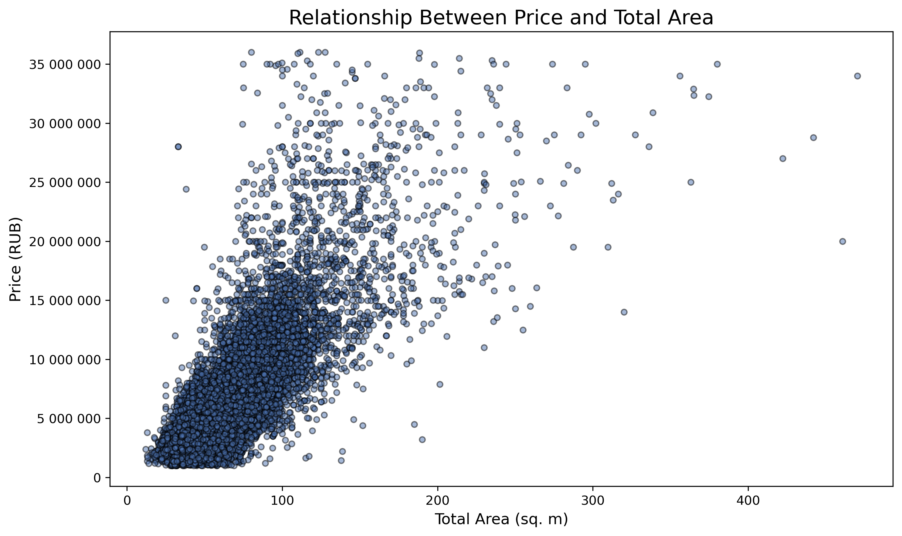
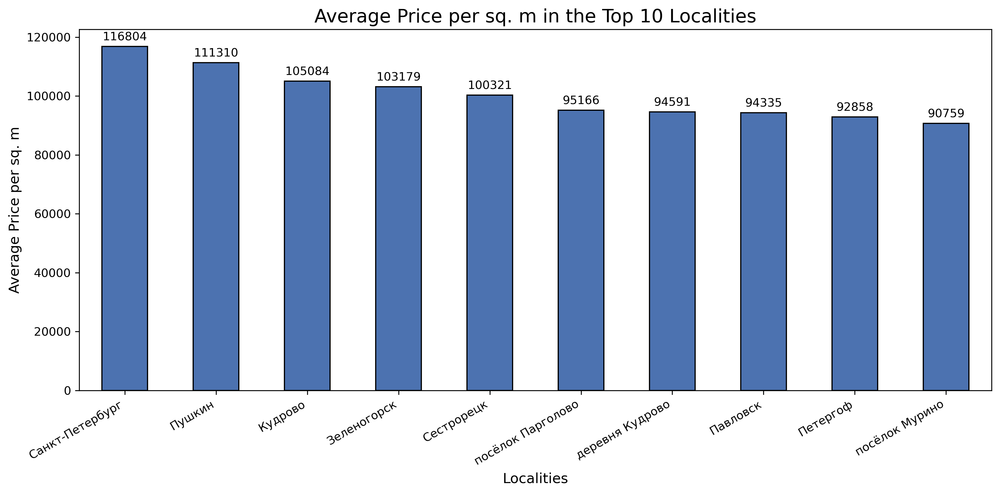

# 🏠 Анализ рынка недвижимости Санкт-Петербурга

**[EN](README.md) | [RU](README.ru.md)**

Исследовательский анализ объявлений о продаже квартир (архив Яндекс Недвижимости): что определяет цену жилья в Санкт-Петербурге и пригородах. Двуязычный проект — полный анализ доступен на английском и русском.

**Главные выводы:** цена квартиры определяется прежде всего **общей площадью** и **расположением** — медианная цена 4.65 млн ₽; половина квартир продаётся за **95 дней**; день недели и месяц публикации на цену не влияют.

## 📋 Задача

Датасет — архив объявлений о продаже квартир в Санкт-Петербурге и соседних населённых пунктах. Цель — определить параметры, формирующие рыночную стоимость, как основу для автоматизированной системы отслеживания аномалий и мошеннических объявлений.

## 📊 Данные

23 699 объявлений (23 613 после очистки) объявлений с двумя типами признаков: заполненные пользователем (цена, площадь, комнаты, этаж, высота потолков) и картографические (расстояния до центра, аэропорта, парков и водоёмов). 

Предобработка: заполнение пропусков по типу признака (медианы для числовых, явные категории для строковых), унификация неявных дубликатов в названиях населённых пунктов, приведение типов, фильтрация выбросов по квантилям и IQR.

**Новые признаки:** цена за м², день недели / месяц / год публикации, тип этажа (первый / последний / другой), расстояние до центра в км.

## 🔍 Ключевые выводы

**Факторы цены.** Сильнее всего на цену влияет общая площадь; за ней — жилая площадь, площадь кухни и число комнат (жилая и общая площади коррелируют на 0.88, их эффекты пересекаются). Цена за м² растёт с общей площадью (корреляция 0.66) — большие квартиры дороже и в пересчёте на метр. Балконы, день недели и месяц публикации значимого влияния не показывают.



**Расположение.** Цены максимальны в центре (0–5 км) и стабилизируются на 5–25 км. Загородные курортные направления (Лисий Нос, Зеленогорск) показывают повышенную цену за м² несмотря на удалённость — эффект природной привлекательности.

 

**Динамика рынка.** Медианное время продажи — 95 дней (среднее 168 дней — его тянет вверх хвост «зависших» объявлений). Продажи до 30 дней можно считать быстрыми; объявления старше 100 дней заслуживают проверки — возможны завышенная цена или проблемы с объектом.

## 🛠 Стек

`Python` · `pandas` · `NumPy` · `Matplotlib` · `Seaborn` · `Jupyter`

## 🚀 Как запустить

```bash
git clone https://github.com/foxypandas/real-estate-analysis.git
cd real-estate-analysis
pip install -r requirements.txt
jupyter notebook notebooks/real_estate_eda_ru.ipynb
```

Датасет в репозиторий не включён. 

## 📁 Структура проекта

```
├── notebooks/     # ноутбуки с анализом (EN и RU версии)
├── images/        # графики и визуализации
└── requirements.txt
```
